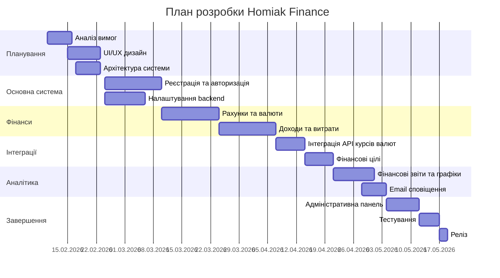

# Планування проєкту та управління ресурсами

**Проєкт:** Homiak Finance  
**Тривалість:** 10.02.2026 – 19.05.2026

Homiak Finance – вебзастосунок для управління особистими фінансами, який дозволяє користувачам відстежувати доходи, витрати, рахунки у різних валютах, а також переглядати фінансову аналітику.

---

# 1. Roadmap

| Sprint   | Dates         | Goals                                                            |
| -------- | ------------- | ---------------------------------------------------------------- |
| Sprint 1 | 10.02 – 23.02 | Аналіз вимог, UX дослідження, створення UI/UX дизайну            |
| Sprint 2 | 24.02 – 09.03 | Реєстрація та авторизація користувачів, базова структура backend |
| Sprint 3 | 10.03 – 23.03 | Реалізація рахунків та підтримка різних валют                    |
| Sprint 4 | 24.03 – 06.04 | Реалізація доходів, витрат та категорій                          |
| Sprint 5 | 07.04 – 20.04 | Інтеграція API курсів валют та фінансові цілі                    |
| Sprint 6 | 21.04 – 04.05 | Фінансові звіти, графіки, email повідомлення                     |
| Sprint 7 | 05.05 – 19.05 | Адмін панель, тестування та фінальний реліз                      |

---

# 2. Milestone Plan

| Milestone | Description                        | Date       |
| --------- | ---------------------------------- | ---------- |
| M1        | Завершено аналіз вимог             | 16.02.2026 |
| M2        | Завершено UI/UX дизайн             | 23.02.2026 |
| M3        | Реалізовано систему авторизації    | 09.03.2026 |
| M4        | Реалізовано систему рахунків       | 23.03.2026 |
| M5        | Реалізовано систему транзакцій     | 06.04.2026 |
| M6        | Інтегровано API курсів валют       | 20.04.2026 |
| M7        | Реалізовано фінансові звіти        | 04.05.2026 |
| M8        | Реалізовано адміністративну панель | 12.05.2026 |
| M9        | Завершено тестування системи       | 17.05.2026 |
| M10       | Фінальний реліз                    | 19.05.2026 |

---

# 3. Gantt Chart

---

# 4. Technological resources

- **Frontend:** React / TypeScript
- **Backend:** Python / FastAPI
- **Database:** PostgreSQL
- **Version Control:** GitHub
- **Design:** Figma
- **Deployment:** AWS
- **External API:** Exchange Rate API

---

# 5. Risk Management

| Risk                        | Description                                      | Mitigation                                |
| --------------------------- | ------------------------------------------------ | ----------------------------------------- |
| API курсів валют недоступне | Неможливо отримати актуальні курси валют         | Використання резервного API або кешування |
| Втрата даних                | Помилки бази даних або сервера                   | Регулярні backup та журналювання          |
| Проблеми безпеки            | Несанкціонований доступ до фінансових даних      | JWT авторизація, HTTPS, шифрування        |
| Перевантаження системи      | Велика кількість запитів може сповільнити роботу | Оптимізація запитів та кешування          |
| Затримка розробки           | Нереалістичні дедлайни або складність функцій    | Agile підхід та планування спринтів       |
| Баги у функціоналі          | Помилки у коді                                   | Code review та регулярне тестування       |

---

# Final Result

У результаті реалізації проєкту буде створено вебзастосунок **Homiak Finance**, який дозволяє:

- реєструватися та входити в систему
- створювати рахунки у різних валютах
- додавати доходи та витрати
- автоматично отримувати курси валют
- переглядати фінансові звіти
- отримувати email повідомлення
- користуватися адміністративною панеллю

**Реліз:** 19.05.2026
