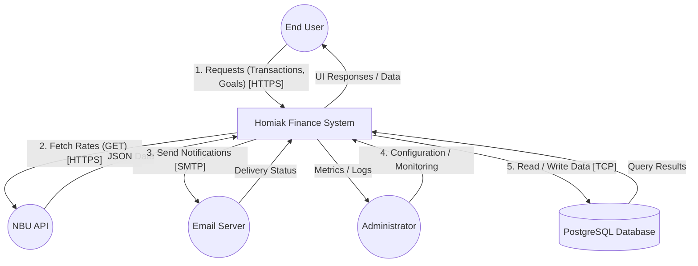

## Resiliency Model

### 1. Context Interaction Diagram (CID)

#### Опис інтеракцій

* **1. Користувач ↔ Система:** Користувач авторизується, додає транзакції та переглядає звіти через веб-інтерфейс (SPA).
* **2. Система ↔ НБУ API:** Фонове завдання робить запити до зовнішнього API для отримання актуальних курсів валют.
* **3. Система ↔ SMTP Server:** Система відправляє email-сповіщення про події (ліміти, курси) через інтеграцію з поштовим сервісом.
* **4. Адміністратор ↔ Система:** Адміністратор змінює налаштування довідників та переглядає метрики здоров'я системи.
* **5. Система ↔ База даних (PostgreSQL):** Збереження та вибірка фінансових даних, налаштувань користувачів та кешованих курсів.

---

### 2. RMA Workbook (Relational Model Analysis)

Аналіз режимів відмов, їх впливу та стратегій пом'якшення наслідків.

| ID | Інтеракція | Можлива відмова (Failure Mode) | Вплив (Impact) | Детекція та Реакція (Detection & Mitigation) |
|:---|:---|:---|:---|:---|
| **1.1** | User ↔ System | Втрата інтернет-з'єднання у клієнта під час роботи. | Неможливість зберегти нову транзакцію на сервері. | **Детекція:** Браузерна подія offline. **Реакція:** Перехід в offline-режим, збереження даних локально. |
| **1.2** | User ↔ System | Висока затримка відповіді API (>300мс). | Погіршення UX, користувач може дублювати запит. | **Детекція:** Моніторинг latency (SLO). **Реакція:** Миттєве відображення змін на фронтенді, ідемпотентність запитів на бекенді. |
| **1.3** | User ↔ System | Закінчення терміну дії JWT токена під час сесії. | Відмова у доступі (401 Unauthorized) при спробі транзакції. | **Детекція:** HTTP 401 відповідь. **Реакція:** Автоматичний запит на оновлення токена (refresh token) або перенаправлення на логін без втрати введених даних. |
| **2.1** | System ↔ NBU API | Зовнішній API недоступний (HTTP 500/Timeout). | Неможливість оновити курси валют на поточний момент. | **Детекція:** Exception у фоновому воркері. **Реакція:** Використання останнього успішно збереженого курсу з кешу БД. |
| **2.2** | System ↔ NBU API | Зміна формату JSON відповіді від НБУ. | Помилка парсингу даних, курси не оновлюються. | **Детекція:** Помилка валідації Pydantic. **Реакція:** Логування помилки для адміна, система продовжує працювати на старих курсах. |
| **2.3** | System ↔ NBU API | Перевищення ліміту запитів (Rate Limiting). | Блокування IP адреси сервера провайдером. | **Детекція:** HTTP 429 відповідь. **Реакція:** Експоненційна затримка (Exponential backoff) перед наступною спробою оновлення. |
| **3.1** | System ↔ SMTP | SMTP сервер недоступний (Connection Refused). | Користувачі не отримують критичні сповіщення. | **Детекція:** Timeout з'єднання. **Реакція:** Механізм черги повідомлень (Dead Letter Queue) з автоматичними повторами (retries). |
| **3.2** | System ↔ SMTP | Перевищення лімітів поштового сервісу (Quota Exceeded). | Тимчасове блокування відправки нових листів. | **Детекція:** Код помилки SMTP 550 або 452. **Реакція:** Сповіщення адміністратора, призупинення розсилок до відновлення квоти. |
| **3.3** | System ↔ SMTP | Дублювання подій (напр., курс змінився кілька разів за хвилину). | Спам користувача сотнями листів. | **Детекція:** Перевірка timestamp останнього сповіщення. **Реакція:** Логіка дебаунсингу (debouncing) та ідемпотентності — одне сповіщення на інтервал часу. |
| **4.1** | Admin ↔ System | Помилка людського фактора (видалення категорії, яка використовується). | Порушення цілісності даних транзакцій користувачів. | **Детекція:** Constraint violation в БД. **Реакція:** Заборона видалення використовуваних сутностей. |
| **4.2** | Admin ↔ System | Втрата доступу до адмін-панелі (збій сервісу автентифікації). | Неможливість оперативного керування. | **Детекція:** Логи помилок входу. **Реакція:** Прямий доступ до БД (в екстрених випадках). |
| **4.3** | Admin ↔ System | Збій системи моніторингу метрик. | Адміністратор "сліпий" щодо стану системи. | **Детекція:** Відсутність нових даних на дашборді. **Реакція:** Health-check endpoint, який працює незалежно від основної системи метрик. |
| **5.1** | System ↔ DB | Тимчасова недоступність БД (перезавантаження/оновлення). | Повна зупинка обробки запитів (Downtime). | **Детекція:** Connection error драйвера БД. **Реакція:** Використання пулу з'єднань з реконнектом; міграції з нульовим простоєм (zero-downtime migrations). |
| **5.2** | System ↔ DB | Повільні запити при великій кількості транзакцій. | Timeout на стороні користувача (порушення вимог продуктивності). | **Детекція:** Логування latency > 300мс. **Реакція:** Індексація таблиць, кешування важких звітів (наприклад, Redis). |
| **5.3** | System ↔ DB | Колізія даних при одночасному редагуванні рахунку. | Некоректний баланс (Race condition). | **Детекція:** Помилка транзакції БД. **Реакція:** Використання блокування на рівні рядків (Row-level locking) або оптимістичного блокування (version checking). |
